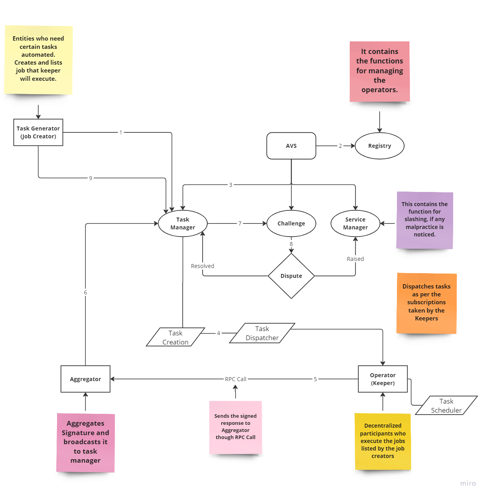

# Keeper Network 2.0 AVS

<b> Do not use it in Production, testnet only. </b>

 <b>Problem: </b> Decentralized networks struggle with task management inefficiencies and economic trust issues. Delays, higher costs, and lack of financial incentives undermine network integrity.

<b>Solution: </b>Our Keeper Network uses AVS and EigenLayer to ensure efficient task execution and economic trust through restaked assets, making participants financially committed to network reliability.

<b>How We Built It:</b> The Keeper Network automates tasks requested by job creators. Here's the detailed process:

Job Creators list tasks for automation.
Registry manages operator registration and credentials.
Task Manager handles task lifecycle, dispatching tasks to keepers.
Operators (Keepers) schedule, execute tasks, and send signed responses.
Aggregator collects and validates responses.
Challenger validates responses and handles disputes.
Service Manager enforces penalties if malpractices are detected.

<b>Restaking Validation:</b> Transparent protocols reward compliant restakers and penalize non-compliance, ensuring a fair and trustworthy system.

<b>Economic Trust:</b> EigenLayer's restaked assets model enhances economic security, ensuring all participants are financially committed to maintaining network integrity.

<b>Applications:</b>

Automating tasks in DeFi.
Regular updates for decentralized apps.
Any system needing reliable, decentralized task management.


A decentralized keeper network leveraging EigenLayer's infrastructure. Developers can list automation jobs specifying a URL of code to execute and intervals. Tasks are assigned to keepers for execution, enhancing network automation and reliability.

## Dependencies

You will need [foundry](https://book.getfoundry.sh/getting-started/installation) and [zap-pretty](https://github.com/maoueh/zap-pretty) and docker to run the examples below.
```
curl -L https://foundry.paradigm.xyz | bash
foundryup
go install github.com/maoueh/zap-pretty@latest
```
You will also need to [install docker](https://docs.docker.com/get-docker/), and build the contracts:
```
make build-contracts
```

## Running via make

This simple session illustrates the basic flow of the AVS. The makefile commands are hardcoded for a single operator, but it's however easy to create new operator config files, and start more operators manually (see the actual commands that the makefile calls).

Start anvil in a separate terminal:

```bash
make start-anvil-chain-with-el-and-avs-deployed
```

The above command starts a local anvil chain from a [saved state](./tests/anvil/avs-and-eigenlayer-deployed-anvil-state.json) with eigenlayer and incredible-squaring contracts already deployed (but no operator registered).

Start the task manager:

```bash
make start-task-manager
```

Register the Keeper(operator) with eigenlayer and incredible-squaring, and then start the process:

```bash
make start-keeper
```

Create a Job: 

```bash
make create-job
```


## Avs Task Description





## resources

Overview of Keeper Network AVS: 
[The Future is Bright: Keeper Networks 2.0 Paves the Way for Secure and Scalable](https://mirror.xyz/0x328f573aB35557d52f8822DAda203dCb4B56da37/bCU89iYEUT5bKBLNZz-3k07aSKh0Fm9MKJFxiA46kiQ)

For more technical insights, [click here!](https://mirror.xyz/0x328f573aB35557d52f8822DAda203dCb4B56da37/VbZOuwYU65h0ZmxC7C-D316O_H5qQ8Z6-L-MDxgxXzw)

YouTube: [Keeper Network 2.0](https://www.youtube.com/playlist?list=PLINrQiiidP8Lj7oWX3KSgXRYX3m2bPedu)

